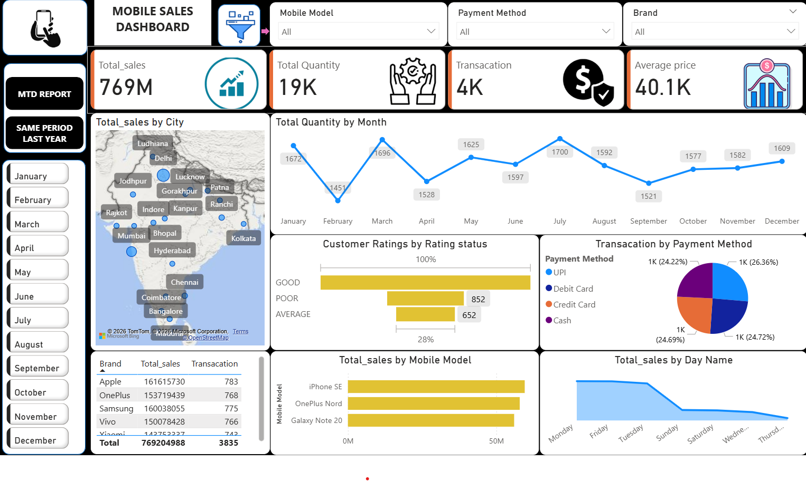
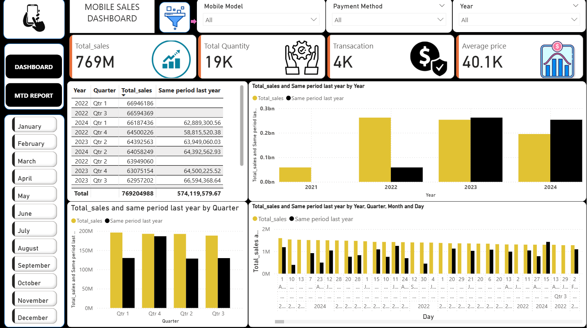
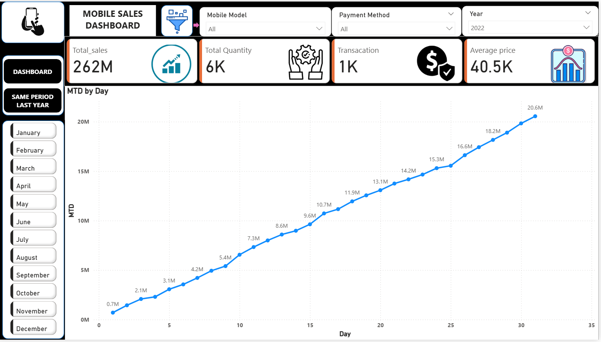

# Mobile-Sales-Analysis-Using-Power-BI
# Mobile Sales Analysis Dashboard

## Project Description
This project is an interactive **Mobile Sales Analysis Dashboard** developed to analyze mobile sales performance across different cities, brands, and time periods. The dashboard provides key insights into sales trends, customer ratings, transaction methods, and product performance.

The project helps businesses understand sales distribution, monitor performance metrics, and identify high-performing products and regions for better decision-making.

## Tools Used
- Power BI
- Data Visualization
- Data Analysis
- DAX

## Key KPIs
- Total Sales
- Total Quantity Sold
- Total Transactions
- Average Price

## Dashboard Pages

### 1. Sales Overview Dashboard
This page provides a complete overview of mobile sales including:
- Total sales by city (Map visualization)
- Total quantity by month
- Customer rating analysis
- Transactions by payment method
- Sales performance by mobile model
- Sales distribution by day

### 2. Sales Comparison Analysis
This page compares current sales with the **same period last year** to track performance growth.  
Insights include:
- Year-wise sales comparison
- Quarter-wise sales comparison
- Detailed daily sales trends
- Sales performance tables

### 3. MTD (Month-to-Date) Report
This page focuses on tracking **month-to-date sales performance** including:
- Daily sales progress
- KPI monitoring
- Time-based sales tracking

## Key Insights
- Identify top-performing mobile brands and models
- Understand customer payment preferences
- Track sales performance by location
- Compare current sales with historical data
- Monitor daily sales growth

## Business Value
This dashboard helps businesses:
- Monitor mobile sales performance
- Track sales growth over time
- Identify profitable products
- Improve strategic decision-making

## Project Preview
## Dashboard Preview

## Sales Comparison

## MTD Report

## Author
Shrikant Jarande
